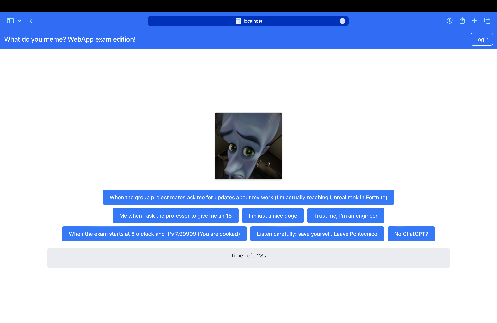
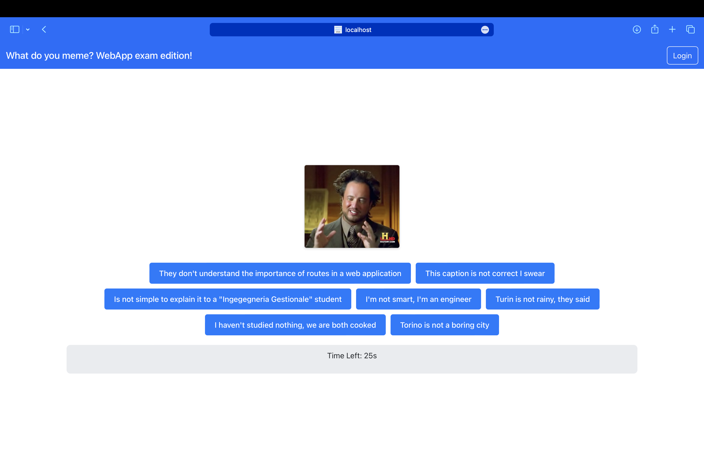

<!--
  English README translated and adapted from the original Italian file.
  Purpose: make the project ready for publication as a personal GitHub repository.
-->

# WhatDoYouMeme — Web App Game

Lightweight React + Express web game where players match funny captions to memes.

This repository contains a React front-end (client) and an Express-based backend (server) that together implement a simple meme caption game with user authentication, game history and scoring.

**Status:** Proof-of-concept / Personal project

---

## Quick Demo

- Frontend: React + Vite
- Backend: Node + Express + SQLite

---

## Features

- Play as guest or authenticated user
- Login / logout sessions
- Fetch meme images and caption options from the server
- Save game results and view personal history and stats

---

## Getting Started

Prerequisites

- Node.js (recommended >= 16) and npm

Client (frontend)

1. Open a terminal and go to the `client` folder:

   ```bash
   cd client
   npm install
   npm run dev
   ```

2. Open the URL printed by Vite (usually `http://localhost:5173`).

Server (backend)

1. In a separate terminal, go to the `server` folder:

   ```bash
   cd server
   npm install
   node index.mjs
   ```

2. By default the server listens on the port defined in `index.mjs` (check the file for the exact port). If you prefer, add a `start` script to `server/package.json`.

Notes

- The server uses SQLite for data persistence. The database file (if present) is managed in the `server` folder.
- If you make changes to the backend, restart `node index.mjs` to apply them.

---

## API (summary)

- POST `/api/sessions` — Log in with credentials. Expect JSON body with `username` and `password`.
- DELETE `/api/sessions/current` — Log out current session.
- GET `/api/memedata` — Retrieve a meme object (`id`, `path`).
- GET `/api/captions/:memeID` — Retrieve caption options for a meme.
- POST `/api/result` — Save game result. Expect JSON body with game data (`userId`, `score`, `date`, ...).
- GET `/api/history/:userId` — Retrieve game history for a user.

Responses use standard HTTP status codes (200, 4xx, 5xx) and return JSON.

For full details, see files in the `server` folder (routes and DAO modules).

---

## Database (tables overview)

- `users`: stores user records (id, username, hashed password, email, salt).
- `memes`: stores meme records (memeID, memePATH).
- `captions`: stores caption records (captionID, memeID, captionTEXT). Some captions may not be associated with a meme (e.g. `memeID = 999`).
- `roundResults`: stores per-round data (roundID, gameID, memeID, caption, score, memePATH).
- `gameResults`: stores game-level results (gameID, userID, score, timestamp).

---

## Main Frontend Components

- `LoginForm` (`src/components/AuthComponents.jsx`) — Login form and authentication flows.
- `HomePage` (`src/components/HomePageComponent.jsx`) — Landing page for guests and logged users.
- `LoggedInUserPageComponent` (`src/components/HomePageComponent.jsx`) — Personal area for logged users.
- `GameComponent` (`src/components/PlayComponents.jsx`) — Main game component that orchestrates rounds, meme display, captions, timer and scoring.
- `ProfileComponent` (`src/components/StatsComponent.jsx`) — Shows user game history and stats.

---

## Screenshots




---

## Test Accounts (for local testing)

- `simone@polito.it` / `Webappexam`
- `luca@polito.it` / `testtest`

Please change or remove these before publishing if they are sensitive.

---

## Contributing

This is a personal project; nevertheless contributions are welcome. To contribute:

1. Fork the repository.
2. Create a branch for your feature or fix.
3. Open a pull request describing your changes.

If you want, I can add a CONTRIBUTING.md and issues board.

---

## License

This repository includes a `LICENSE` file in the root. Review it for license details.

---

## Contact

For questions or help, open an issue or contact the repository owner.
